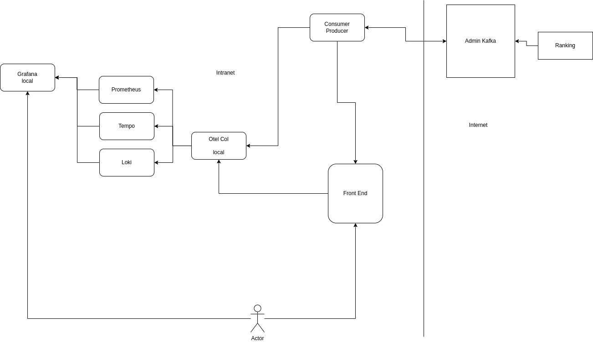

# Course Autonome de l'Ensimag à Michelin

Bienvenue dans le projet **Course Autonome de l'Ensimag à Michelin** ! Ce projet est une application web interactive qui simule un parcours en voiture, avec des interactions en temps réel avec un backend. L'objectif est de fournir une expérience immersive en combinant des technologies front-end et back-end, tout en intégrant des communications via Kafka.

A la fin du projet, pensez à remplir le formulaire suivant pour nous faire nos retours (il y a également un petit quizz...): https://forms.office.com/e/UjtY3Vc9wf

## Table des Matières

- [Course Autonome de l'Ensimag à Michelin](#course-autonome-de-lensimag-à-michelin)
  - [Table des Matières](#table-des-matières)
  - [Description du Projet](#description-du-projet)
  - [Fonctionnalités Principales](#fonctionnalités-principales)
  - [Prérequis](#prérequis)
  - [Installation](#installation)
  - [Usage](#usage)
  - [Architecture du Projet](#architecture-du-projet)
  - [Atelier](#atelier)
    - [Docker](#docker)
    - [Ansible](#ansible)
    - [Installation du front et du back](#installation-du-front-et-du-back)
    - [Kafka](#kafka)
    - [OpenTelemetry](#opentelemetry)
  - [Technologies Utilisées](#technologies-utilisées)
  - [Contribuer](#contribuer)
  - [Licence](#licence)

## Description du Projet

La **Course Autonome de l'Ensimag à Michelin** est une application web qui simule une course entre plusieurs voitures. Elle affiche des informations telles que le nombre de kilomètres parcourus, le nombre d'instructions traitées, des logs, et des boutons pour tester la connectivités ou démarrer la course. L'application interagit avec un backend pour recevoir des instructions de navigation en temps réel, permettant ainsi aux utilisateurs de vivre une expérience interactive.

## Fonctionnalités Principales

- **Affichage en Temps Réel** : Distance parcourue, instructions traitées mises à jour dynamiquement.
- **Instructions de Navigation** : Recevez des indications de direction (tourner à gauche, tourner à droite, aller tout droit) depuis le backend.
- **Modales d'Information** : Affichage des logs pour connaître le démarrage, les erreurs, et la fin de la simulation.
- **Intégration Kafka** : Communication avec un backend Python via Kafka pour gérer les instructions et les actions.
- **Observabilité avec OpenTelemetry** : Intégration d'OpenTelemetry pour collecter des traces, des logs et des métriques, facilitant le suivi et l'analyse des performances de l'application.

## Prérequis

Avant de commencer, assurez-vous d'avoir les éléments suivants installés sur votre machine :
- **Editeur de texte**
- **docker** 
Bonjour Meriyam,

Nous avons 2 offres de stage sur de la cyber :
- Stage de fin d'étude d'Analyste Sécurité EPP/EDR (antivirus) Orienté Usine
- Blue Team (SOC), big data, nouvelle génération d’outil/méthodes de détect

Je vous invite à choisir un créneau dans mon agenda pour un rendez-vous. 

Cordialement
## Installation

Suivez les étapes ci-dessous pour installer et exécuter le projet sur votre machine locale.

**1. Cloner le Répertoire du Projet**

```
git clone https://github.com/Michelin-Ensimag/workshop_ensimag.git
cd workshop_ensimag
```

## Usage

1. **Démarrage de la Simulation** : À l'ouverture de la page, une carte s'affiche. Cliquez sur le bouton **Démarrez la Course** pour commencer la simulation. Cela envoie une requête au backend pour signaler que vous êtes prêt.

2. **Réception des Instructions** : L'application commencera à recevoir des instructions de navigation du backend toutes les 1 à 3 secondes.

3. **Fin de la Simulation** : Une fois toutes les instructions traitées, vous serez arrivé à Michelin et vous le verrez dans les logs.

## Architecture du Projet



- **Frontend** : HTML, CSS, JavaScript, communique par API via websocket.
- **Backend** : Application Python utilisant FastAPI pour gérer les endpoints et interagir avec Kafka pour consommer et produire des messages.
- **Kafka** : Utilisé pour la communication entre le backend et d'autres services, en gérant les instructions et les actions.
- **OpenTelemetry** : Intégré pour la collecte de métriques, logs et traces, facilitant l'observabilité et le suivi des performances.

## Atelier

### Docker

La première étape consiste à construire une image docker via le docker file.

Votre image devra avoir le tag workshop_ensimag:latest

hints : RTFM

```
docker XXX -t workshop_ensimag:latest
```

Pour valider :
```
docker image ls workshop_ensimag
```

Ensuite vous devez run votre image pour créer un container

```
docker run -d --rm --name ensimag_workshop -p 3000:3000 -p 3001:3001 -v ./ansible_workshop:/ansible -v ./backend-pilot:/back workshop_ensimag:latest
```

Pour la suite vous allez executer un bash dans votre container (nous vous conseillons d'ouvrir plusieurs terminaux et d'avoir x terminaux par appli à exécuter):

hints : tldr (c'est encore mieux que man ! https://github.com/tldr-pages/tldr)
```
docker XXX
```

### Ansible

Maintenant que vous avez un bash dans votre container, exécutez le playbook ansible qui va installer toutes les briques nécessaires pour la partie "observabilité" de cet atelier.

Dans la commande ci-dessous, l'option `-i` permet de spécifier sur quel inventaire Ansible on se base pour exécuter le playbook. Un inventaire peut correspondre par exemple à un environnement (au sens dev/recette/préproduction/production/...), c'est l'endroit où on spécifie quel serveur appartient à quel groupe Ansible (par exemple, on donne l'adresse ou l'IP d'un serveur pour les services web, une autre pour la base de données, encore une autre pour les services annexes,...). Dans un inventaire, on spécifie aussi les valeurs des différentes variables utilisées dans les playbooks (ces variables pouvant changer en fonction de l'environnement sur lequel on fait le déploiement)

Un playbook est un peu comme le "code source" du déploiement, c'est lui qui va spécifier quelles sont les actions à exécuter via des modules Ansible (créer un répertoire, ouvrir un port, créer un fichier et le remplir en fonction de différentes variables,...). Il est possible de créer des "roles" Ansible, ils sont l'équivalent des pacakges en Java, en Go, en C,... Ils premettent de rassembler des actions génériques qu'on va vouloir réutiliser dans différents playbooks (par exemple un role qui va mettre en place une certaine arborescence de répertoires suivant une norme), ils peuvent également permettre de simplifier la lecture d'un playbook, par exemple le playbook `playbooks/install_observability.yml` crée un répertoire, puis il inclut différents roles qui installent chacun des composants d'observabilité, une lecture rapide permet donc de savoir ce que fait un playbook. Pour savoir dans le détail comment chaque composant s'installe, on consulte son role associé.

Pour plus d'informations sur ces concepts, vous pouvez consulter la documentation d'Ansible:

- [Inventaires](https://docs.ansible.com/ansible/latest/inventory_guide/intro_inventory.html)
- [Playbooks](https://docs.ansible.com/ansible/latest/playbook_guide/playbooks_intro.html)
- [Roles](https://docs.ansible.com/ansible/latest/playbook_guide/playbooks_reuse_roles.html)

```
ansible-playbook -i inventories/prod playbooks/install_observability.yml 
```

Maintenant nous devons lancer 3 backend et grafana
Tempo : backend pour les traces
Loki : backend pour les logs
Prometheus : backend pour les metrics
Grafana : pour visualiser les données des différents backend

Ouvrir un terminal et exécutez un bash dans le container
```
ls /script
```

Maintenant l'objectif est d'aller voir ce qui se passe dans grafana

... Malheur ! On dirait que la configuration de Grafana n'est pas à jour, en effet, on est censé pouvoir accéder à Grafana sur le port `3000`, mais on dirait que Grafana a été configuré pour écouter un autre port. Il faut changer ça. Incide: Ce genre de configuration se fait dans un inventaire, et pensez bien à rejouer le playbook d'installation après avoir fait votre modification, vous aurez alors un apperçu de l'idempotence d'Ansible :)

Parcourir les différentes variables utilisées dans les playbooks (et roles & templates) ansible et connectez-vous à Grafana

grep est votre ami

Assurez-vous d'avoir des données dans l'onglet explore sur les différentes datasources (backends)

### Installation du front et du back

Application pilote avec interface Leaflet pour visualiser le parcours d'une voiture autonome en temps réel via Kafka.

Dans le container docker, installez uv (`curl` ou `pip` sont vos amis). Puis trouvez la commande à lancer (indice : mettez à jour les dépendances du projet --> aidez vous de la commande `uv --help`)

```bash
uv ...
```
Lancez l'application avec `uv`. 

### Kafka

Choisissez un `group_id_pilot` unique en changeant le fichier `config.ini`. 

Code à trou, à l'aide de la documentation, remplissez les parties où il y a écrit #TODO.


### OpenTelemetry

Pour les plus avancés, nous allons envoyer des logs, des metrics et des traces depuis notre back et notre front.

Récupérez la branche correspondante pour commencer :

```bash
git checkout add-otel
```

Pour instrumenter le backend, nous vous conseillons de regarder du côté de :

- `setup_opentelemetry()`
- `FastAPIInstrumentor.instrument_app`

Maintenant, essayez de réaliser le dashboard Grafana qui est dans `img/dash.png` en utilisant des metrics, des traces et des logs.

Ouvrez une pull request sur le GitHub avec votre dashboard exporté au format JSON.

## Technologies Utilisées

- **Python** et **FastAPI** pour le backend.
- **Kafka** (Confluent) pour la gestion des messages en temps réel.
- **HTML**, **CSS**, **JavaScript** et **Flask** pour l'interface utilisateur.
- **OpenTelemetry** pour l'observabilité, permettant la collecte de traces, logs et métriques.

## Contribuer

Pour contribuer à ce projet, veuillez consulter le fichier [CONTRIBUTING.md](CONTRIBUTING.md).

## Licence

Ce projet est sous licence MIT. Consultez le fichier [LICENSE](LICENSE) pour plus d'informations.
